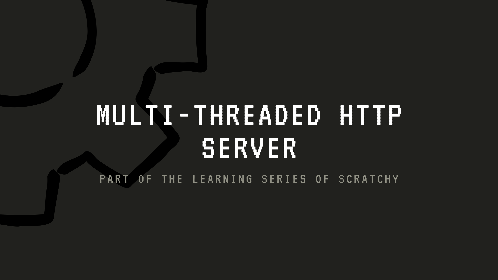

# Scratchy — HTTP/1.0 Request Handler over Raw TCP/IPv4 Sockets

*Part of the Scratchy series: building foundational software from first principles, one layer at a time.*

---

## Current State
- Introducing multithreading using epoll(), to handle concurrent users.
- a full pdf file will be provided to explain the whole process, for those who want to learn.
- a much more complex routing system will be implemented.
  
 

---

## What Is This

An HTTP server built entirely from scratch using C libraries, one level above the POSIX API.
the prototype is offered in Python for better code readability and comprehension, Go is used for orchestration and stress-testing.
OMGG! I love Goroutines, they are a very great tool to introduce and build concurrent programs without the burden of dealing with threads logic and race conditions (hopefully), as the Go's compiler will handle all the mapping's work by itself.

---

### Important

I would be grateful if you can read all of the fluff coming (README), as I document everything in a nice & comprehensive way, you will learn a thing or two as I did.

Following a simple yet very effective rule I learned from Remzi H. Arpaci-Dusseau and Andrea C. Arpaci-Dusseau the writers of the book OS : Three Easy Steps,
RTFM "Read The Manual" and the 'F' is added for aesthetics ;)


---

### How To Use

this is simple straight forward guide on how you can host the server on your local machine.

compile the files using options such as -g (for debugging), -Wall to show all warnings 

```bash
make
```
use the commad ip, to extract your local machine ip address.

```bash
ip a
```
choose a port using and open it to allow other machines within the network to connect, using 8080 for instance

```bash
sudo wfu allow 8080
```
from the main director, execute

```bash
./driver ip-address port
```

now you can access ip:port/ from any device within the network.

---

## Philosophy

Starting with the smallest thing that works. Getting one client talking to one server. Then adding just enough to handle real HTTP. Then adding mechanisms to handle concurrent users and requests (I hate dealing with that sh*t). No step is skipped. Without forgetting the first rule 'RTFM' ;).

---

## Stack

**Python** — standard library only. No third-party packages. The `socket` module handles all network I/O, `threading` will handle concurrency, and `json` handles body serialization.

**Go** — using net package, for stress-testing, and  orchestration.

**C** — just being C, the mighty (context-relative not absolutely), it's powerful enough, and using it is as using the System's System Calls API itself (kind of).

---

## Project Stages

- **Stage 1** — Raw socket communication: server binds, listens, accepts, sends.
- **Stage 2** — HTTP compliance: parse real HTTP requests, respond with correct HTTP format including status line, headers, and body.
- **Stage 3** — Routing: map paths to handlers, return different responses based on the requested URL.
- **Stage 4** — Concurrency: introduce threading so multiple clients can connect simultaneously without blocking each other.

---

## Goal

A multi-threaded HTTP/1.0 server/request handler with a companion script that spawns multiple simultaneous clients — each connecting, sending a request, and receiving a response — to demonstrate the server handling real concurrent load.

After ensuring stability and the ability to handle concurrent users, it will be upgraded to support HTTP/1.1 then HTTP/2, and possibly HTTP/3 :)
the differences between the protocol will be discussed later.

---

## Important Design Decisions

Not much decisions were taken, you might be wondering why, I will tell you in a minute :

- Most of the implementations are strict pre-agreed-upon protocols that were designed by better engineers (than you, not me) to follow certain rules and constraints.


---

## Purpose

Coding has become less and less attractive in the recent years, as creativity and originality became victims of LLMs spread. That's why I felt the need and the urge to build projects from scratch to reinforce the use of basic tools such as manuals, standard libraries and debugging (and show the world how much of a 'CHAD' I am). Why is that you might be wondering, because C's syntax is minimal, every mistake or a failure in the program is mostly a logical error (kind of), not because of my unfamiliarity with the language/framework, which you helped to shift my way of thinking from 'maybe there are tools that Python/JS offer, and I am not aware of' to 'Sh*t, there is no parser in C, now I have to build one myself' - feel the difference ? real engineering mindset there. Now I sound like ChatGPT.

If it was up to me, I would use assembly (not really!), but compilers such as, gcc and clang are powerful enough to generate better assembly than what all of humanity combined could possibly generate, and eventually it will take me months to years to build one project.

Believe me, you still don't know how much gcc and clang are broken, unfortunately they are not getting much appreciation as Chatgpt and Claude, let's not forget the mighty (context-relative not absolutely) LLVM (you don't know what LLVM is, sorry we cannot be friends! google it you moron).

so each time you type `gcc ...` or `g++ ...` don't forget to thank god, that they do exist, because one day they won't (essence of life, not uncalculated judgement).

---

## Honorable Mention & Inspiration

the one and only, Daniel Hirsch.
<https://www.youtube.com/@HirschDaniel>

---

## The Scratchy Series

Scratchy is a personal project series dedicated to rebuilding common software tools without relying on the libraries that normally hide their complexity. Each project in the series targets one layer of the stack.